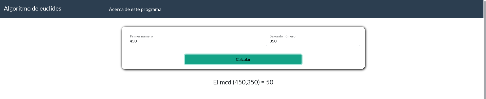
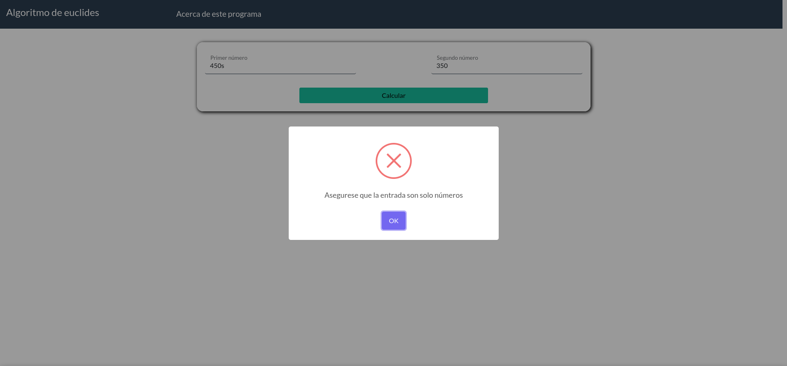

# Algoritmo de euclides

Esta es una pagina hecha con html,css y javascript
para aplicar el [algoritmo de Euclides](https://es.khanacademy.org/computing/computer-science/cryptography/modarithmetic/a/the-euclidean-algorithm) pasando como entrada dos números

## Autor

- [Sergio David Paez Suarez](https://github.com/spaezsuarez) - **20191020167**

## Vistas de la pagina

- Menu principal

- Uso de la aplicación

- Manejo de entradas invalidas

